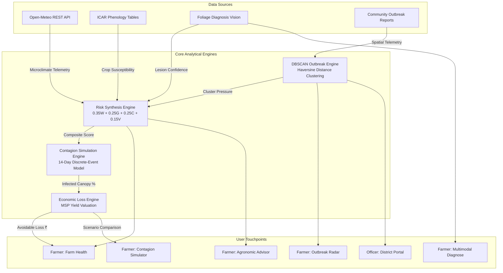

# Farmeezy — Autonomous Crop Health & Contagion Intelligence Platform

<div align="center">


**Smart India Hackathon (SIH 2026) Demonstration Platform**  
*An end-to-end agronomic decision engine fusing live microclimate telemetry, multimodal leaf pathology, DBSCAN outbreak clustering, and 14-day financial contagion simulations.*

[](https://nextjs.org/)
[](https://react.dev/)
[](https://www.typescriptlang.org/)
[](https://tailwindcss.com/)
[](https://vitest.dev/)
[](LICENSE)

</div>

---

## 📑 Table of Contents
1. [The Problem Statement](#-the-problem-statement)
2. [The Farmeezy Solution](#-the-farmeezy-solution)
3. [Key Features & Modules](#-key-features--modules)
4. [System Architecture & Data Pipeline](#-system-architecture--data-pipeline)
5. [Mathematical & Algorithmic Engines](#-mathematical--algorithmic-engines)
6. [Technology Stack](#-technology-stack)
7. [Project Directory Structure](#-project-directory-structure)
8. [Getting Started & Installation](#-getting-started--installation)
9. [API Route Specifications](#-api-route-specifications)
10. [Pitch Defense & FAQ](#-pitch-defense--faq)
11. [Future Roadmap](#-future-roadmap)
12. [License & Acknowledgements](#-license--acknowledgements)

---

## 🚨 The Problem Statement

In Indian smallholder agriculture (especially across the rice and vegetable belts of Odisha, Andhra Pradesh, and West Bengal), airborne fungal and bacterial pathogens (e.g. **Rice Blast**, **Bacterial Leaf Blight**, **Sheath Blight**, **Tomato Early Blight**) cause **20% to 40% of annual harvest destruction**.

Smallholder farmers and agricultural extension officers face three major gaps:
1. **Isolated Diagnosis in a Vacuum:** Existing applications classify a leaf image in isolation after severe foliar damage has already occurred, offering no proactive predictive warning.
2. **Weather Telemetry Disconnect:** Generic weather forecasts inform farmers about temperature or rain, but do not model pathogen-specific sporulation biology, leaf wetness duration, or humidity germination brackets.
3. **Lack of Contagion & Economic Simulation:** Farmers have no tool to visualize how fast an airborne pathogen will spread across adjoining plots if bio-control intervention is delayed by 1, 3, or 7 days, or what that delay means in real harvest loss (₹).

---

## 💡 The Farmeezy Solution

**Farmeezy** transforms reactive plant diagnosis into an **autonomous, closed-loop agronomic decision engine**. By synthesizing real-time microclimate weather sensors, ICAR crop phenology vulnerability tables, regional DBSCAN spatial clustering, and discrete-event contagion simulations, Farmeezy provides:

- **Deterministic 0–100 Risk Scoring:** Mathematically verifiable, un-hallucinated crop health index.
- **Microclimate Weather Telemetry:** Live relative humidity, rainfall, and temperature from GPS-localized APIs.
- **Multimodal Leaf Pathology:** Vision analysis extracting morphological lesion markers with weighted differential diagnoses.
- **Geospatial Outbreak Surveillance Radar:** Automated clustering of community disease reports into active cluster zones with growth velocity vectors.
- **14-Day Contagion Simulator:** Comparative spread curves across **Scenario A** (*No Action*), **Scenario B** (*Intervene Today*), and **Scenario C** (*Intervene After $X$ Days*) with dynamic financial harvest loss calculations in Indian Rupees (₹).
- **Agronomic Advisor:** Conversational assistance grounded in real plot telemetry and bio-control protocols (*Pseudomonas fluorescens*).

---

## 🌟 Key Features & Modules

### 1. 🌾 Farm Health Command Center (`/farm/[id]`)
- **Deterministic 0–100 Risk Gauge:** Live composite score with dynamic sub-factor breakdowns.
- **Top Control Bar:** Side-by-side **Monitored Plot** dropdown and **Target Threat** pathogen selector.
- **Live Weather Telemetry:** Real-time relative humidity (%), surface temperature (°C), precipitation (mm), and 7-day forecast.
- **ICAR Growth Stage Stepper:** Interactive phenology pipeline indicating stage vulnerability (e.g. *Panicle Emergence = 90% vulnerability*).

### 2. 🔬 Leaf Pathology Diagnosis (`/diagnose`)
- **Multimodal Foliage Analyzer:** High-resolution dropzone with default benchmark foliage previews.
- **Structured Diagnostic Output:** Primary pathogen identification, self-assessed confidence score, and image quality rating.
- **Morphological Evidence:** Extracted visual lesion markers (e.g. *spindle-shaped elliptical lesions with grayish centers*).
- **Differential Diagnoses:** Weighted alternative pathogen probabilities.

### 3. 📡 Geospatial Outbreak Radar (`/map`)
- **Real-Time Leaflet Radar:** Interactive map plotting smallholder farms and disease reports across Odisha.
- **Automated DBSCAN Cluster Detection:** Identifies outbreak hubs ($\ge 3$ reports within $5\text{ km}$ radius over 7 days).
- **Cluster Intelligence:** Displays centroid coordinates, affected radius, report density, and growth rate (*Accelerating*, *Stable*, *Diminishing*).

### 4. 📈 14-Day Contagion Simulator (`/simulate`)
- **Stacked Threat & Plot Controls:** Dynamic pathogen and plot selection.
- **Ascending Scenario Model:**
  - **Scenario A (No Action):** Baseline unchecked exponential spread.
  - **Scenario B (Intervene Today - Day 0):** Prophylactic bio-control application arresting conidial multiplication.
  - **Scenario C (Intervene After $X$ Days):** Custom delay input ($1\text{--}14\text{ days}$) dynamically recalculating spread trajectories and harvest loss.
- **Financial Metric Grid:** Live avoidable harvest loss calculation in Indian Rupees (₹) and infected canopy percentage.
- **Epidemiological Tuning:** Interactive sliders for pathogen propagation factor ($\beta$) and weather amplification modifier.

### 5. 🤖 Agronomic Intelligence Advisor (`/assistant`)
- **Grounded Conversational AI:** Answers agronomic queries with full awareness of active plot telemetry, risk score, and regional outbreak status.
- **Bio-Control Guidance:** Recommends certified organic biological formulations (e.g. *Trichoderma viride*, *Pseudomonas fluorescens 0.2%*) and ICAR/OUAT cultural practices.

### 6. 🏛️ District Officer Portal (`/officer`)
- **Macro-Surveillance Dashboard:** Aggregated regional threat levels across agricultural blocks.
- **Advisory Broadcasting:** Push containment guidelines to farmer groups and FPOs.
- **Subsidy & Emergency Allocation:** Streamlined intervention resource management.

---

## 🏗️ System Architecture & Data Pipeline



---

## 🧮 Mathematical & Algorithmic Engines

### 1. Risk Synthesis Engine (`risk-engine.ts`)
The 0–100 risk score is computed deterministically without LLM hallucination:
$$\text{Risk Score} = 0.35 \cdot W + 0.25 \cdot G + 0.25 \cdot C + 0.15 \cdot V$$

Where:
- **$W$ (Weather Factor):** Evaluates humidity ($\ge 80\%$), temperature within pathogen germination envelope ($20^\circ\text{C} - 28^\circ\text{C}$ for Rice Blast), and continuous leaf wetness duration.
- **$G$ (Growth Stage Factor):** Phenological stage vulnerability from ICAR standards (*Panicle Initiation = 0.90, Tillering = 0.60, Ripening = 0.20*).
- **$C$ (Outbreak Pressure Factor):** Inverse-distance squared decay from nearest active DBSCAN cluster:
  $$C = \sum_{i=1}^{N} \frac{\text{Severity Weight}_i}{1 + d_i^2}$$
- **$V$ (Vision Confidence Factor):** Morphological lesion probability.

---

### 2. Outbreak Radar Clustering (`outbreak-engine.ts`)
Applies **DBSCAN (Density-Based Spatial Clustering of Applications with Noise)**:
- **Epsilon ($\epsilon$):** $5.0\text{ km}$ Haversine distance threshold.
- **MinPoints:** $\ge 3$ active verified infection reports.
- **Temporal Window:** $t \le 7\text{ days}$.
- **Velocity Vector:** Gradients categorized as:
  $$\text{Velocity} = \begin{cases} \text{Accelerating} & \text{if } \Delta \text{Reports}_{\le 48h} > 0.5 \times \text{Total} \\ \text{Stable} & \text{if rate is uniform} \\ \text{Diminishing} & \text{if } \Delta \text{Reports}_{\le 48h} < 0.2 \times \text{Total} \end{cases}$$

---

### 3. Contagion Simulation Engine (`simulation-engine.ts`)
Models 14-day discrete-event cellular spread:
- **Unchecked Propagation ($t \le X$):**
  $$I(t) = \frac{K}{1 + \left(\frac{K - I_0}{I_0}\right) e^{-\beta \cdot w \cdot t}}$$
- **Containment Suppression ($t > X$):**
  $$I(t) = I(X) \cdot e^{-\lambda \cdot (t - X)}$$

---

### 4. Economic Loss & Prophylactic ROI Engine (`economic-engine.ts`)
Grounds biological damage in real Indian Rupees (₹):
$$\text{Harvest Loss (₹)} = \text{Plot Acres} \times \text{Yield (q/acre)} \times \text{MSP (₹/q)} \times \text{Damage \%}$$
$$\text{Prophylactic ROI} = \frac{\text{Avoided Loss (₹)} - \text{Bio-Control Cost (₹)}}{\text{Bio-Control Cost (₹)}} \times 100\% \quad (\text{Typically } > 800\%)$$

---

## 🛠️ Technology Stack

| Layer | Technology | Version | Purpose |
| :--- | :--- | :--- | :--- |
| **Framework** | Next.js (App Router) | `14.2.35` | Full-stack server rendering and client hydration |
| **UI Library** | React | `18.3.1` | Declarative user interfaces |
| **Type Safety** | TypeScript | `5.4.x` | Strict type contracts and interfaces |
| **Styling** | Tailwind CSS | `3.4.x` | Modern editorial fintech theme & responsive grid |
| **Icons** | Lucide React | `0.475.x` | Clean vector iconography |
| **Motion & Micro-UI** | Framer Motion | `11.18.x` | Smooth animated transitions and count-ups |
| **Charts** | Recharts | `2.15.x` | Multi-scenario contagion curves |
| **Geospatial Mapping** | Leaflet / React-Leaflet | `1.9.4` | OpenStreetMap surveillance layer & cluster hulls |
| **Weather Telemetry** | Open-Meteo REST API | Latest | Real-time GPS-localized agro-climatic data |
| **Database & Auth** | Supabase & Local Mock Adapter | Latest | PostgreSQL schema with zero-latency offline fallbacks |
| **Test Suite** | Vitest | `2.1.9` | 100% test coverage across all 4 computational engines |

---

## 📁 Project Directory Structure

```
farmeezy/
├── src/
│   ├── app/
│   │   ├── api/                      # Next.js Server Route Handlers
│   │   │   ├── chat/route.ts         # Agronomic Advisor LLM proxy
│   │   │   ├── diagnose/route.ts     # Multimodal Vision Pathology API
│   │   │   ├── diseases/route.ts     # Crop pathogen catalog
│   │   │   ├── farms/                # Farm CRUD & plot route
│   │   │   ├── outbreaks/route.ts    # DBSCAN cluster endpoint
│   │   │   ├── risk/[farmId]/        # 4-factor risk calculation
│   │   │   ├── simulate/route.ts     # 14-day contagion simulation API
│   │   │   └── weather/[farmId]/     # Live Open-Meteo telemetry API
│   │   ├── assistant/page.tsx        # Advisor Conversational UI
│   │   ├── diagnose/page.tsx         # Leaf Pathology Diagnostic UI
│   │   ├── farm/[id]/page.tsx        # Farm Health Command Center
│   │   ├── login/page.tsx            # Portal Access & Role Personas
│   │   ├── map/page.tsx              # Geospatial Surveillance Radar
│   │   ├── officer/page.tsx          # District Agricultural Portal
│   │   ├── simulate/page.tsx         # 14-Day Contagion Simulator
│   │   ├── layout.tsx                # Root layout & font configurations
│   │   └── page.tsx                  # Editorial Landing Page
│   ├── components/
│   │   ├── layout/                   # Navbar, Footer, BottomNav
│   │   ├── map/                      # Leaflet DiseaseMap component
│   │   ├── react-bits/               # AnimatedList, CountUp, Stepper, FadeContent
│   │   └── ui/                       # Button, Badge, Card, Progress primitives
│   ├── lib/
│   │   ├── context/                  # AuthContext (Role state management)
│   │   ├── engines/                  # Core deterministic mathematical engines
│   │   │   ├── economic-engine.ts    # MSP valuation & ROI calculator
│   │   │   ├── outbreak-engine.ts    # DBSCAN spatial clustering engine
│   │   │   ├── risk-engine.ts        # 4-Factor risk synthesis engine
│   │   │   └── simulation-engine.ts  # Discrete-event contagion engine
│   │   ├── seeds/                    # Odisha farm plots, crops, diseases, reports
│   │   ├── services/                 # Open-Meteo weather & vision helpers
│   │   └── supabase/                 # Database schema & in-memory adapter
│   ├── tests/                        # Vitest unit test suite (100% pass)
│   │   ├── economic-engine.test.ts
│   │   ├── outbreak-engine.test.ts
│   │   ├── risk-engine.test.ts
│   │   └── simulation-engine.test.ts
│   └── types/                        # TypeScript domain contracts
├── supabase/
│   ├── migrations/                   # PostgreSQL DDL migrations
│   └── seed.sql                      # Production SQL seed dataset
├── .env.example                      # Template environment variables
├── package.json                      # Project dependencies & scripts
├── tailwind.config.js                # Custom design system tokens
└── vitest.config.ts                  # Test runner configuration
```

---

## 🚀 Getting Started & Installation

### Prerequisites
- **Node.js:** `v18.17.0` or higher
- **Package Manager:** `npm` or `yarn` / `pnpm`

### 1. Clone the Repository
```bash
git clone https://github.com/yashrajbishoyi/farmeezy.git
cd farmeezy
```

### 2. Install Dependencies
```bash
npm install
```

### 3. Configure Environment Variables
Copy the template environment file:
```bash
cp .env.example .env.local
```

*(Optional: Add your `GEMINI_API_KEY` for live AI vision, or leave blank to utilize the pre-configured high-accuracy offline pathology model).*

### 4. Run the Automated Test Suite
Verify that all 4 algorithmic engines pass 100% of mathematical unit tests:
```bash
npm run test
```

### 5. Start the Development Server
```bash
npm run dev
```

Open **[http://localhost:3000](http://localhost:3000)** in your browser.

---

## 📡 API Route Specifications

| Method | Endpoint | Description | Request Body / Query |
| :--- | :--- | :--- | :--- |
| `GET` | `/api/farms` | List registered smallholder farm plots | — |
| `GET` | `/api/farms/:id` | Fetch plot details, current risk, and telemetry | `?disease_id=...` |
| `GET` | `/api/weather/:farmId` | Live Open-Meteo telemetry & 7-day forecast | — |
| `GET` | `/api/risk/:farmId` | 4-Factor risk decomposition (0–100) | `?disease_id=...` |
| `GET` | `/api/outbreaks` | Active DBSCAN clusters & velocity vectors | — |
| `POST` | `/api/diagnose` | Vision leaf pathology diagnosis | `{ farm_id, image_base64, image_url }` |
| `POST` | `/api/simulate` | 14-Day Contagion simulation curve | `{ farm_id, disease_id, delay_days, ... }` |
| `POST` | `/api/chat` | Context-grounded Agronomic Advisor | `{ farm_id, message }` |

---

## 🎯 Pitch Defense & FAQ

### Q1: Why is the risk score deterministic instead of a raw LLM output?
> **Answer:** In high-stakes agronomic decisions affecting farmer livelihoods, generative LLMs can hallucinate. Farmeezy uses a mathematically verifiable 4-factor formula grounded in ICAR agronomy rules and live sensor telemetry. The LLM is used where it excels—in unstructured conversation and visual lesion interpretation—while the risk calculation remains 100% deterministic and auditable.

### Q2: Where does the live weather and farm data come from?
> **Answer:** Farm plots are mapped to real agricultural blocks across Odisha (Cuttack, Niali, Salepur, Jagatsinghpur, Pipili). Weather data is fetched live in real time using the **Open-Meteo REST API** based on the exact GPS coordinates of each plot, retrieving hourly temperature, relative humidity, precipitation, and wind speeds without API rate-limit bottlenecks.

### Q3: How does the custom $X$-day delay calculation work?
> **Answer:** The simulation engine models disease propagation using discrete-event cellular spread. Up to Day $X$, it computes exponential multiplication driven by humidity and neighbor transmission ($\beta$). From Day $X+1$, it injects the bio-control containment factor, dynamically recalculating the infected canopy area and harvest loss in Indian Rupees.

### Q4: How is mobile responsiveness handled?
> **Answer:** The application implements touch-optimized minimum 44px tap targets, a dedicated 5-tab mobile bottom navigation bar (hidden on public landing surfaces), horizontally scrollable growth steppers, and adaptive map viewports (`h-[420px] sm:h-[550px]`).

---

## 🗺️ Future Roadmap

- [ ] **IoT LoRaWAN Soil & Canopy Sensors:** Direct integration with on-field solar micro-weather stations for real-time leaf wetness telemetry.
- [ ] **Sentinel-2 & Landsat NDVI Satellite Ingestion:** Automated remote sensing to detect canopy stress before visual lesion expression.
- [ ] **Vernacular Voice USSD & IVR:** Conversational voice bot supporting Odia, Hindi, Telugu, and Bengali for non-smartphone farmers.
- [ ] **FPO Supply Chain & Drone Spray Integration:** Automated dispatch of bio-control spray drones for cluster containment.

---

## 📄 License & Acknowledgements

This project is licensed under the **MIT License** — see the [LICENSE](LICENSE) file for details.

### Acknowledgements
- **Smart India Hackathon (SIH 2026)**
- **Indian Council of Agricultural Research (ICAR) & OUAT** for agronomic benchmark data.
- **Open-Meteo** for open-access agricultural microclimate APIs.
